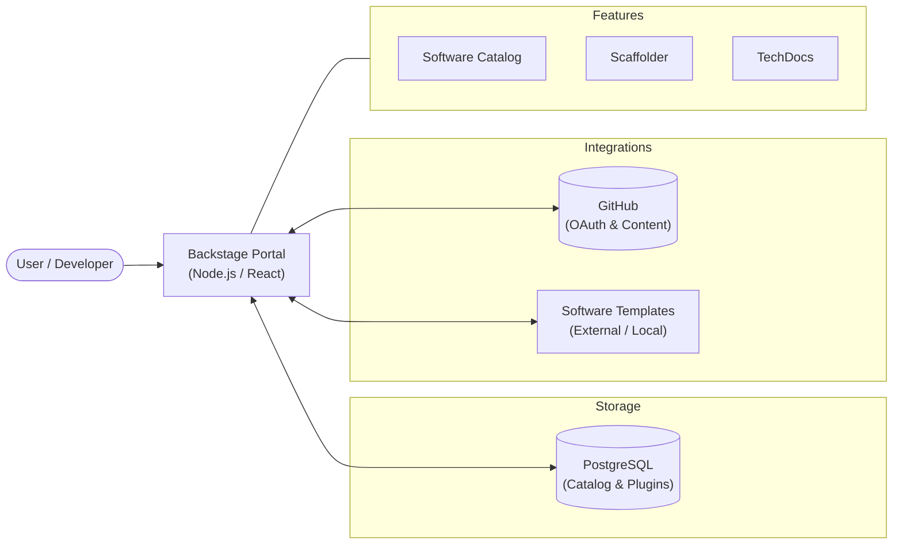

# Internal Developer Portal (Backstage)

[](https://backstage.io)
[](https://nodejs.org)
[](https://yarnpkg.com)

This is the primary **Internal Developer Portal (IDP)** based on Spotify's [Backstage](https://backstage.io). It serves as a unified platform that brings together all your infrastructure tooling, services, and documentation in a single, consistent interface.

---

## 🌟 Core Pillars

- **Software Catalog**: A centralized registry of all software components (services, websites, libraries, pipelines).
- **Software Templates**: Standardized scaffolding to create new components in seconds (e.g., the [Quarkus Gold Template](https://github.com/chrom/quarkus-ms-gold-template)).
- **TechDocs**: Documentation-as-code solution, making it easy to create, manage, and read technical documentation.
- **Search**: Powerful global search across the entire catalog and documentation.

---

## 🏗 System Architecture

The following diagram represents the core components of the IDP and how they interact with external systems and the database.



---

## 🛠 Getting Started

### Prerequisites

- **Node.js 22 or 24**
- **Yarn 4** (Corepack enabled)
- **Docker** and **Docker Compose**

### 1. Local Development Mode

Start the portal locally for development and testing:

```bash
yarn install
yarn start
```

- **Frontend**: [http://localhost:3000](http://localhost:3000)
- **Backend**: [http://localhost:7007](http://localhost:7007)

### 2. Full Stack (Docker Compose)

The easiest way to run the entire portal with its PostgreSQL database:

```bash
make start
```

- **Portal Access**: [http://localhost:7007](http://localhost:7007)

---

## 🔐 Authentication & Access

This portal is configured for a **Proof of Concept (PoC)** with the following setup:

### Guest Access (Default)
The **Guest Provider** is enabled for easy local exploration. Simply click "Enter" on the login screen to start using the portal with a guest identity.

### GitHub OAuth (Optional)
To enable real identities and GitHub integrations:
1. Create a GitHub OAuth App.
2. Set `AUTH_GITHUB_CLIENT_ID` and `AUTH_GITHUB_CLIENT_SECRET` in your `.env` file.
3. Configure the callback URL to `http://localhost:3000/api/auth/github/handler/frame`.

---

## 📦 Makefile Reference

Available in the `backstage/` directory:

| Command | Description |
|---------|-------------|
| `make start` | Spin up Backstage + PostgreSQL via Docker Compose |
| `make stop` | Stop and remove containers (data preserved in volumes) |
| `make clean` | Full reset: removes containers, networks, and all database data |
| `make auth-info` | Display detailed information about Authentication configuration |
| `make docker-build` | Build a production-ready Docker image for the portal |

---

## 📖 Related Projects

- [Quarkus Microservice Gold Template]: The reference template used for scaffolding new services.
- [Official Backstage Documentation](https://backstage.io/docs): Learn more about extending this portal.

---

Developed by the **Platform Engineering Team**.
Maintainer: @recruiter_wb_vita
